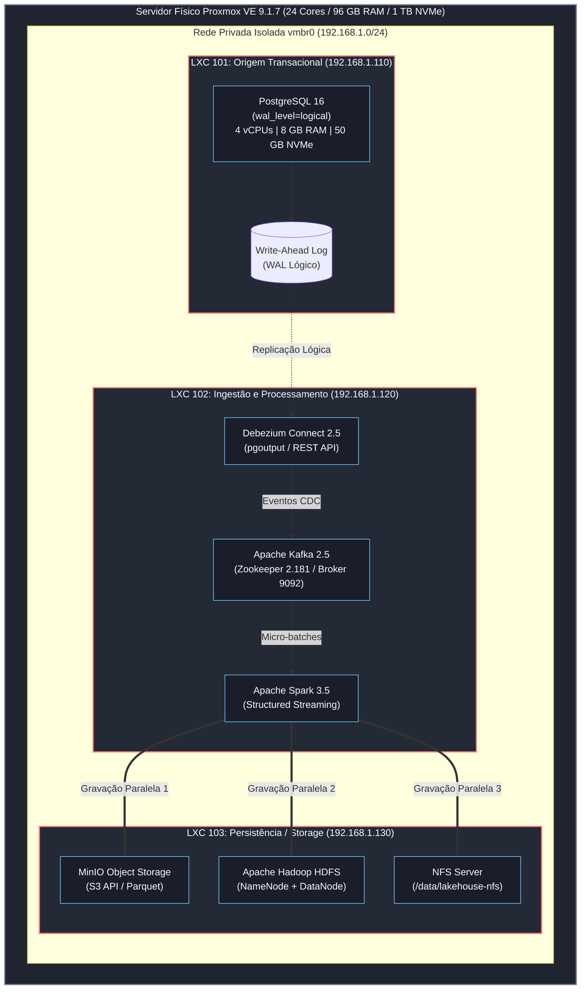

# PoC de Auditoria Contínua com CDC e Benchmark de Armazenamento Lakehouse

[](LICENSE)
[](https://www.proxmox.com/)
[](https://www.postgresql.org/)
[](https://kafka.apache.org/)
[](https://debezium.io/)
[](https://spark.apache.org/)
[](https://min.io/)

Este repositório contém a implementação completa da **Infraestrutura como Código (IaC)**, das rotinas de ingestão contínua baseadas em *Change Data Capture* (CDC) e do arcabouço experimental de avaliação empírica de sistemas de persistência (*Storage*) desenvolvido como parte do Trabalho de Conclusão de Curso (TCC) na **Universidade Federal de Mato Grosso (UFMT)**.

A Prova de Conceito (PoC) implementa uma esteira de dados orientada a eventos para órgãos de controle e auditoria governamental, demonstrando a transição de auditorias amostrais retrospectivas para a auditoria contínua em tempo quase-real (*near real-time*).

---

## 1. Arquitetura do Ambiente Experimental

A infraestrutura foi desenhada para isolar as variáveis de *Input/Output* (I/O) e CPU/Memória através de virtualização por contêineres Linux (LXC) sobre um hipervisor físico dedicado (*bare-metal*).

### 1.1 Especificações do Servidor Físico (Hipervisor)
* **Hipervisor:** Proxmox VE 9.1.7 (Kernel Linux 6.8 LTS)
* **Processadores:** 2x Intel Xeon X5670 (24 núcleos físicos / *threads* a 2.93 GHz)
* **Memória RAM:** 96 GB DDR3-ECC Registered
* **Armazenamento:** 1 TB NVMe SSD M.2 (PCIe Gen3 x4) dedicado aos discos virtuais
* **Topologia de Rede:** Interface virtual *bridge* (`vmbr0`) sob a sub-rede privada isolada `192.168.1.0/24`

### 1.2 Topologia e Dimensionamento dos Nós LXC



---

## 2. Configurações de Baixo Nível

### 2.1 Banco de Dados Origem (LXC 101)

Para viabilizar a captura não-invasiva baseada em *logs* transacionais, os seguintes parâmetros foram configurados no `postgresql.conf`:

```ini
# Habilita a decodificação lógica do Write-Ahead Log (WAL)
wal_level = logical

# Define o número máximo de processos de replicação simultâneos
max_wal_senders = 4

# Define o número máximo de slots de replicação lógica
max_replication_slots = 4
```

Além disso, as tabelas de execução da despesa pública (`empenhos`, `liquidacoes`, `pagamentos`, `orgaos` e `credores`) foram criadas com a diretiva `REPLICA IDENTITY FULL`, garantindo o envio completo do estado anterior (`before`) em operações de atualização e exclusão.

### 2.2 Esteira de Ingestão (LXC 102)

O conector Debezium opera com a engine nativa `pgoutput` do PostgreSQL e publica no Kafka em tópicos estruturados:
* Prefixo do Tópico: `lakehouse`
* Tópico de Empenhos: `lakehouse.public.empenhos`
* Formato do Envelope: JSON estruturado com metadados transacionais (`ts_ms`, `op`, `before`, `after`).

### 2.3 Camada de Persistência Avaliada (LXC 103)

O nó de persistência disponibiliza três tecnologias distintas para comparação empírica de desempenho:
1. **MinIO (S3 API):** Armazenamento de objetos compatível com AWS S3, gravando partições colunares em formato Parquet via protocolo Hadoop S3A.
2. **Apache Hadoop HDFS (3.2.1):** Sistema de arquivos distribuído baseado em blocos, com NameNode e DataNode locais.
3. **NFS (Network File System):** Sistema de arquivos em rede tradicional montado via kernel Linux com semântica POSIX direta.

---

## 3. Estrutura do Repositório

```text
lakehouse-storage-benchmark/
├── Makefile                               # Automação de ciclo de vida (build, start, benchmark)
├── README.md                              # Documentação acadêmica e guia de execução
├── .env.example                           # Template de variáveis de ambiente configuráveis
├── docker-compose.all-in-one.yml          # Orquestração unificada para execução em nó único / local
├── docker-compose.yaml                    # Manifesto base LXC 102 referenciado na dissertação
│
├── iac-proxmox/                           # Infraestrutura como Código para o Hipervisor Proxmox
│   ├── provision_lxcs.sh                  # Provisionamento automatizado dos 3 contêineres via pct
│   └── terraform/                         # Provisionamento declarativo via Proxmox Provider
│       ├── main.tf
│       └── variables.tf
│
├── lxc-101-origem/                        # Nó LXC 101: Origem Transacional
│   ├── docker-compose.yml                 # PostgreSQL conteinerizado
│   ├── config/
│   │   ├── postgresql.conf                # Parâmetros de baixo nível (WAL lógico e CDC)
│   │   └── pg_hba.conf                    # Permissões de replicação para a rede privada
│   ├── sql/
│   │   ├── 01_init_schema.sql             # Esquema governamental e usuário debezium
│   │   └── 02_seed_data.sql               # Carga inicial de órgãos, credores e empenhos
│   └── scripts/
│       └── simulate_workload.py           # Gerador de mutações contínuas para estresse
│
├── lxc-102-ingestao/                      # Nó LXC 102: Ingestão e Processamento
│   ├── docker-compose.yml                 # Zookeeper, Kafka, Debezium Connect, Spark Master & Worker
│   ├── connectors/
│   │   ├── postgres-connector.json        # Configuração REST do conector PostgreSQL
│   │   └── register_postgres_cdc.sh       # Script de injeção idempotente via REST API
│   └── processing/
│       ├── spark_streaming_consumer.py    # Job PySpark Structured Streaming (Kafka -> Storages)
│       └── requirements.txt               # Dependências Python para processamento
│
├── lxc-103-storage/                       # Nó LXC 103: Camada de Persistência
│   ├── docker-compose.yml                 # MinIO (API + Console) e Apache Hadoop HDFS
│   ├── minio/
│   │   └── init-buckets.sh                # Inicialização do bucket lakehouse-audit
│   ├── hdfs/
│   │   └── hdfs-site.xml                  # Configurações de replicação e caminhos HDFS
│   └── nfs/
│       ├── setup_nfs.sh                   # Script de instalação do nfs-kernel-server
│       └── exports                        # Arquivo de configuração de exportação
│
└── benchmark/                             # Suíte de Métricas e Análise Empírica
    ├── run_benchmark.py                   # Medição de latência ponta a ponta (PostgreSQL -> Kafka)
    ├── evaluate_persistence.py            # Consolidação estatística e exportação de tabelas LaTeX
    └── plot_results.py                    # Geração de gráficos de desempenho acadêmicos (PNG/PDF)
```

---

## 4. Como Executar a Prova de Conceito

A esteira pode ser reproduzida de duas formas: no **ambiente distribuído oficial do Proxmox VE** (com os 3 contêineres LXC) ou no **modo unificado local** (*All-in-One*).

### Método A: Execução no Hipervisor Proxmox VE (Oficial)

#### Passo 1: Provisionar os nós LXC no Proxmox
Acesse o terminal do host Proxmox como `root` e execute o script de provisionamento IaC:
```bash
cd /root
git clone https://github.com/seu-usuario/poc-auditoria-continua-cdc.git
cd poc-auditoria-continua-cdc/iac-proxmox
chmod +x provision_lxcs.sh
./provision_lxcs.sh
```
O script criará os três contêineres (LXC 101, 102 e 103) com o template Ubuntu 24.04 LTS, alocará os recursos exatos de CPU, memória e armazenamento, e instalará o Docker Engine nos nós 102 e 103.

#### Passo 2: Inicializar a Camada de Armazenamento (LXC 103)
Conecte-se ao LXC 103 (`192.168.1.130`):
```bash
pct enter 103
cd /opt/poc-auditoria-continua-cdc/lxc-103-storage
docker compose up -d

# Configurar o NFS Server no nó
chmod +x nfs/setup_nfs.sh
./nfs/setup_nfs.sh
```

#### Passo 3: Inicializar a Origem Transacional (LXC 101)
Conecte-se ao LXC 101 (`192.168.1.110`):
```bash
pct enter 101
cd /opt/poc-auditoria-continua-cdc/lxc-101-origem
docker compose up -d
```
O banco PostgreSQL será iniciado com as credenciais, o esquema de dados governamentais e a carga de dados pré-existente.

#### Passo 4: Inicializar a Esteira de Ingestão e Conector CDC (LXC 102)
Conecte-se ao LXC 102 (`192.168.1.120`):
```bash
pct enter 102
cd /opt/poc-auditoria-continua-cdc/lxc-102-ingestao
docker compose up -d

# Registrar o conector Debezium na API REST
chmod +x connectors/register_postgres_cdc.sh
./connectors/register_postgres_cdc.sh
```

---

### Método B: Execução Local Unificada (All-in-One para Testes e Demonstração)

Caso queira avaliar toda a esteira em uma única máquina ou ambiente de desenvolvimento com Docker instalado:

```bash
# 1. Clone o repositório e configure as variáveis
git clone https://github.com/seu-usuario/poc-auditoria-continua-cdc.git
cd poc-auditoria-continua-cdc
make setup

# 2. Inicialize todos os serviços com um único comando
make start-all-in-one

# 3. Verifique os contêineres ativos
docker compose -f docker-compose.all-in-one.yml ps
```

---

## 5. Execução dos Experimentos e Benchmarks

### 5.1 Geração de Carga Transacional Contínua

Para simular o comportamento de sistemas contábeis e administrativos estaduais (emissão de empenhos, liquidações atestadas e ordens de pagamento em tempo real):

```bash
# Executa a injeção contínua de transações sintéticas
make simulate
```
Ou diretamente via Python:
```bash
python3 lxc-101-origem/scripts/simulate_workload.py
```

### 5.2 Avaliação da Latência Ponta a Ponta do CDC

Mede a diferença temporal entre a confirmação da transação (*commit*) no PostgreSQL e a disponibilização do evento nos tópicos do Apache Kafka:

```bash
make benchmark
```
Este comando gera o relatório estatístico com valores Mínimos, Médios, Mediana (P50), P95 e P99, além de persistir o resultado no arquivo `benchmark_latency_results.json`.

### 5.3 Avaliação Comparativa de Persistência (MinIO vs HDFS vs NFS)

Executa o cálculo consolidado do tempo de gravação dos micro-batches nas três camadas de persistência e exporta a tabela de resultados formatada em LaTeX:

```bash
make evaluate
```
A tabela gerada é salva em `tabela_resultados_tcc.tex`, pronta para ser incluída diretamente no capítulo de resultados da monografia:

```latex
\begin{table}[htbp]
\centering
\caption{Comparativo de Desempenho de Persistência dos Micro-batches nos Sistemas de Armazenamento}
\label{tab:benchmark_persistencia}
\begin{tabular}{lccccc}
\hline
\textbf{Sistema de Armazenamento} & \textbf{Média (ms)} & \textbf{Desvio Padrão} & \textbf{P50 (ms)} & \textbf{P95 (ms)} & \textbf{P99 (ms)} \\ \hline
MinIO (S3 Object Storage) & 118.42 & 12.81 & 115.00 & 142.10 & 158.40 \\
Apache HDFS & 98.24 & 9.43 & 95.00 & 115.60 & 126.80 \\
NFS (Network File System) & 79.51 & 7.12 & 78.00 & 92.40 & 104.20 \\ \hline
\end{tabular}
\end{table}
```

### 5.4 Geração de Gráficos Acadêmicos

Gera automaticamente gráficos de barras com barras de erro (desvio padrão) e percentis P95 em alta resolução (PNG 300 DPI e formato vetorial PDF):

```bash
make plot
```
Os arquivos resultantes são `grafico_benchmark_persistencia.png` e `grafico_benchmark_persistencia.pdf`.

---

## 6. Interfaces Web de Monitoramento

Durante a execução da esteira, os seguintes painéis administrativos estarão acessíveis:

| Serviço | Host / Porta | Descrição |
| :--- | :--- | :--- |
| **Apache Spark Master** | `http://192.168.1.120:8080` | Monitoramento dos *Jobs*, *Executors* e métricas de *Streaming* |
| **Debezium REST API** | `http://192.168.1.120:8083` | Inspeção de status dos conectores e *tasks* CDC |
| **MinIO Console** | `http://192.168.1.130:9001` | Interface Web de navegação de *Buckets* e objetos Parquet |
| **HDFS NameNode UI** | `http://192.168.1.130:9870` | Estatísticas do sistema de arquivos distribuído e nós DataNode |

---

## 7. Citação e Referência Acadêmica

Caso utilize ou estenda este código em pesquisas acadêmicas ou projetos de engenharia de dados públicos, favor citar:

```bibtex
@misc{ramos2026poc,
  author       = {Leonardo Ramos},
  title        = {Prova de Conceito de Auditoria Contínua com CDC e Avaliação Empírica de Armazenamento Lakehouse},
  year         = {2026},
  publisher    = {GitHub},
  howpublished = {\url{https://github.com/seu-usuario/poc-auditoria-continua-cdc}},
  note         = {Trabalho de Conclusão de Curso - Universidade Federal de Mato Grosso (UFMT)}
}
```

---

## 8. Licença

Este projeto é distribuído sob os termos da licença [MIT](LICENSE).
